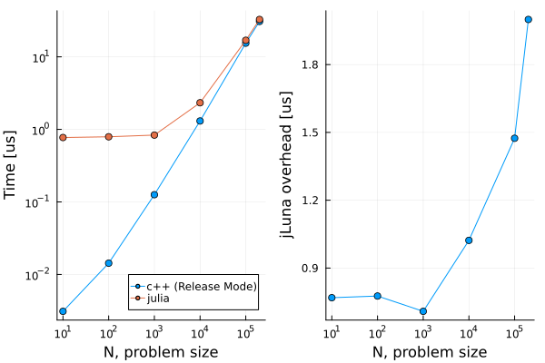

# jluna + Docker

After cloning this repo, 
```
docker compose build
docker compose up
```

`docker exec -it <container name> bash` to get into the container

Build:
```
cd /root/doubleIt
mkdir build
cd build
cmake -DCMAKE_BUILD_TYPE=Release ..
make
```

Run the demo executable
```
cd /root/doubleIt/build
./main
```

the expected output is something like
```
hello from julia
[0] in: 0.68496 | C++: 1.36992 |  Julia: 1.36992
[1] in: 0.873393 | C++: 1.74679 |  Julia: 1.74679
[2] in: 0.882608 | C++: 1.76522 |  Julia: 1.76522
[3] in: 0.378197 | C++: 0.756395 |  Julia: 0.756395
[4] in: 0.497081 | C++: 0.994162 |  Julia: 0.994162
[5] in: 0.652911 | C++: 1.30582 |  Julia: 1.30582
[6] in: 0.193949 | C++: 0.387897 |  Julia: 0.387897
[7] in: 0.268078 | C++: 0.536156 |  Julia: 0.536156
[8] in: 0.653548 | C++: 1.3071 |  Julia: 1.3071
[9] in: 0.516391 | C++: 1.03278 |  Julia: 1.03278
EQUALITY TEST PASSED
Time C++  : 1.3274 us/loop
Time Julia: 2.3184 us/loop
```

Note, if the build type is set to `Debug` (default) , C++ code takes 11.9 us/loop, but with  `Release` mode, it takes 1.3 us/loop. 


Here is a plot of the timing comparisons between `julia` and `c++`:

